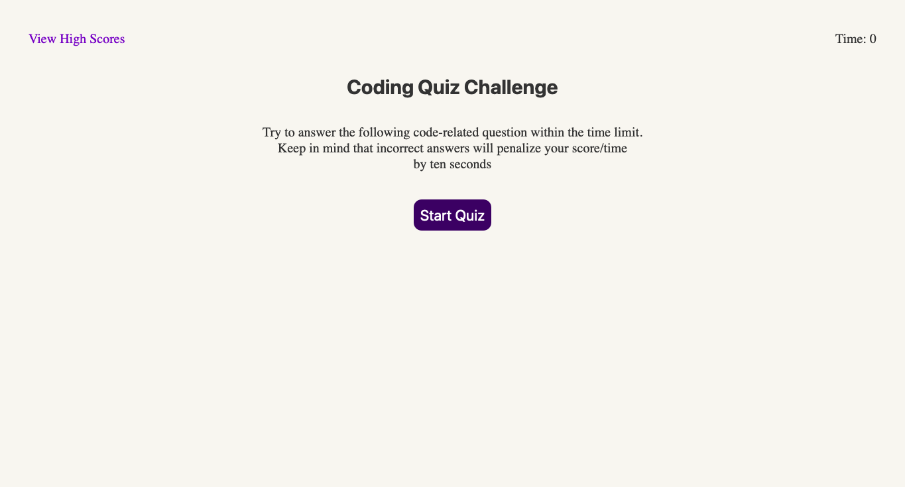
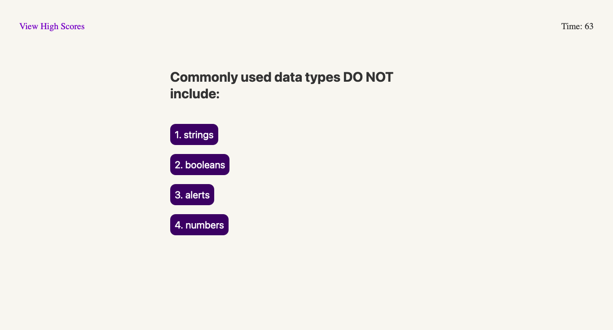
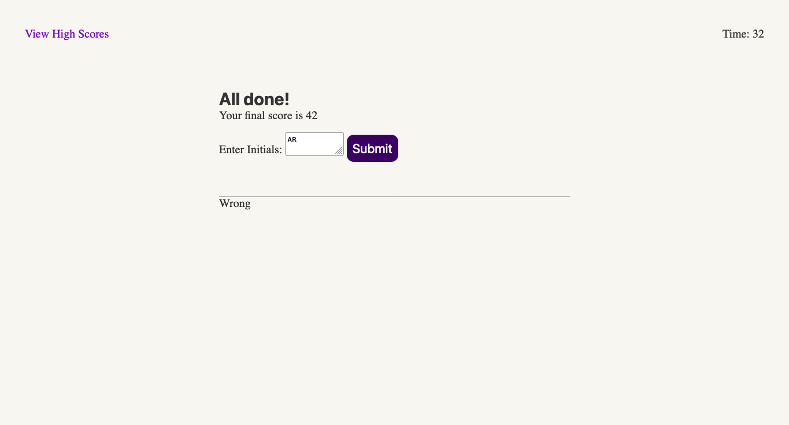
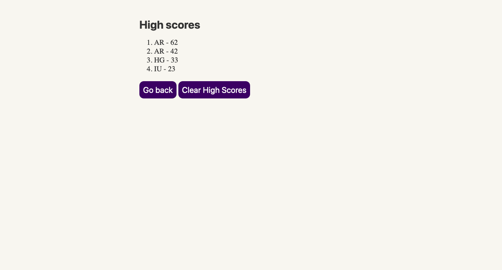

# code-quiz
Challenge 4 - Description: This challenge involves building a quiz that will test the knowledge of the user within a time limit of 75 seconds. 

As the user clicks on the answer to a question, they will be shown the next question. If the user answers the question wrong, 10 seconds will be deducted from their timer. Once the user reaches the end, they will be asked to enter their initials so that their score can be recorded to the highscores list(and added to localstorage). 

If their score is one of the top 10 highest scores, their score will be posted in the high scores list which they can clear if they wish to do so.

Screenshot: 

URL: https://askarrizvi.github.io/code-quiz/

